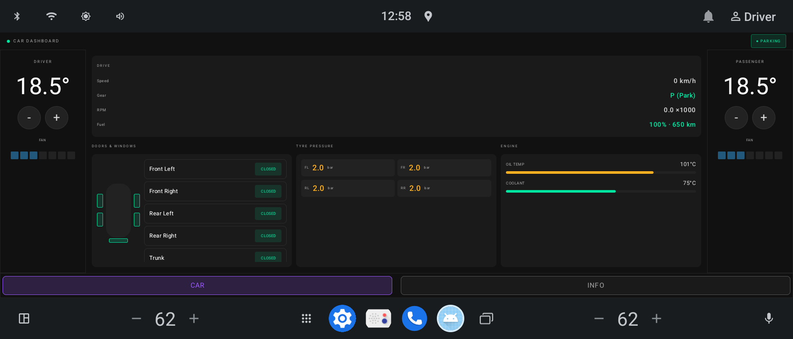
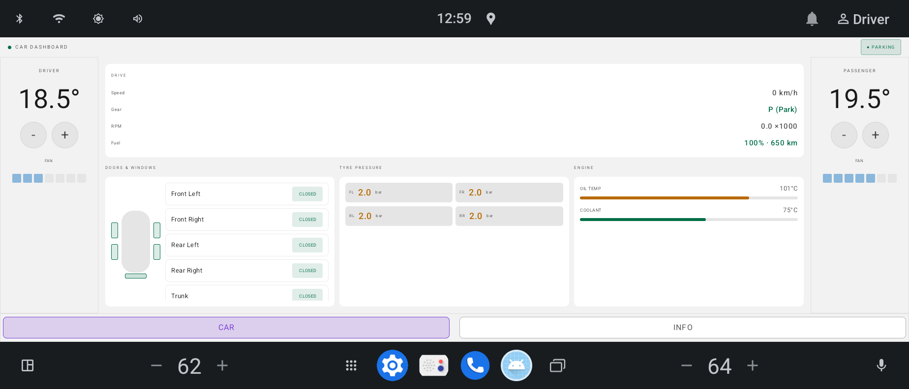
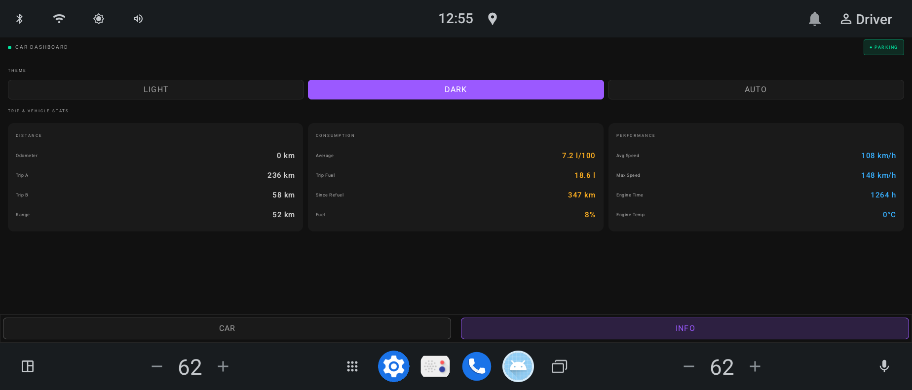
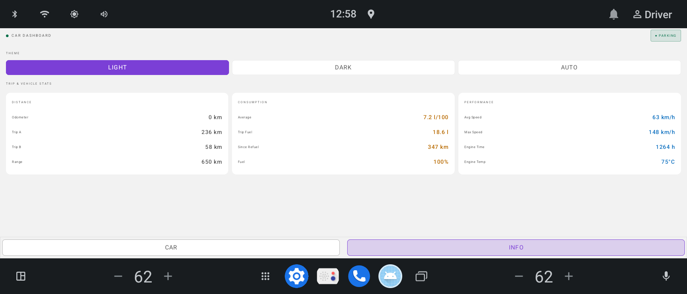
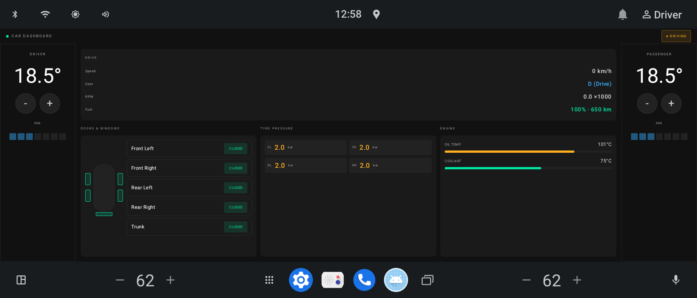
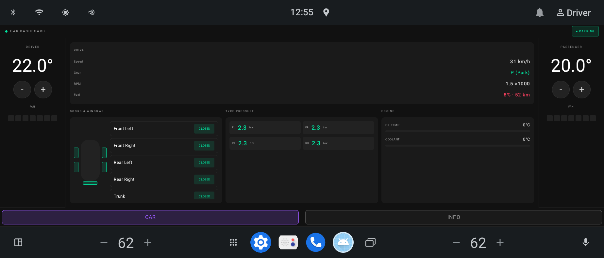

# Monitor — AAOS Car Dashboard

A privileged system application for **Android Automotive OS (AAOS)** that reads live vehicle
data through the Car Property API and renders it as a real-time dashboard.

Built as a research and portfolio project to explore the AAOS platform — CarPropertyManager,
CarUxRestrictionsManager, VHAL property subscription, Material Design 3 theming, and
Jetpack Compose on automotive head units.

---

## Screenshots

| CAR tab — dark | CAR tab — light |
|:-:|:-:|
|  |  |

| INFO tab — dark | INFO tab — light |
|:-:|:-:|
|  |  |

| Driving mode (tabs hidden) | CAR tab — low fuel warning |
|:-:|:-:|
|  |  |

---

## Tech Stack

| Layer | Technology |
|-------|-----------|
| Language | Kotlin |
| UI | Jetpack Compose + Material Design 3 |
| Architecture | MVVM + Repository pattern |
| DI | Dagger 2 |
| Async | Kotlin Coroutines + StateFlow |
| Platform | Android Automotive OS (AAOS), AOSP |
| Car APIs | `CarPropertyManager`, `CarUxRestrictionsManager`, `CarDrivingStateService` |
| Build | Soong (`Android.bp`), platform-signed system app |

---

## Architecture

```
MonitorActivity
    └── MonitorViewModel          (StateFlow<MonitorUiState>)
            └── MonitorRepository (interface)
                    └── MonitorRepositoryImpl
                            ├── CarPropertyManager    → VHAL property subscription
                            └── CarUxRestrictionsManager → driving mode detection
```

**Data flow:** VHAL events → `CarPropertyManager.CarPropertyEventCallback` →
`MutableStateFlow<MonitorData>` → ViewModel `combine()` → Compose recomposition.

**Driving mode** is detected exclusively via `CarUxRestrictionsManager`:
`isRequiresDistractionOptimization = true` maps to `UxMode.DRIVING`. In DRIVING mode
the bottom tab bar is hidden and the screen is locked to the CAR tab; climate controls
remain interactive.

---

## Features

### CAR tab

Three-column layout visible at all times, including while driving.

**Driver / Passenger climate** (side columns)
- Temperature display with ±0.5 °C step buttons — writes `HVAC_TEMPERATURE_SET`
- Fan level bar (7 segments) — writes `HVAC_FAN_SPEED`
- Temperature range and fan max read dynamically from `CarPropertyConfig`

**Drive stats** (center, top)
- Speed (km/h), gear (P/R/N/D), RPM, fuel level and range

**Doors & Windows / Tyre Pressure / Engine** (center, bottom row — 3 equal columns)
- Door state indicators — read-only, driven by `DOOR_POS` events
- Tyre pressure per wheel in bar (source: `TIRE_PRESSURE` in kPa ÷ 100); colour-coded green / amber / red
- Engine oil and coolant temperature bars

### INFO tab *(PARKING mode only)*

Trip and vehicle stats across three cards: Distance, Consumption, Performance.
Theme switcher: **LIGHT / DARK / AUTO** (AUTO follows system dark-mode via `isSystemInDarkTheme()`).

---

## Key AAOS Concepts Demonstrated

- **VHAL property subscription** via `CarPropertyManager.subscribePropertyEvents()` with
  per-property update rates (`setUpdateRateUi` for speed/RPM, `setUpdateRateNormal` for
  slow sensors, on-change for gear/HVAC/doors).
- **CarUxRestrictionsManager** for distraction-optimized UI — app declared
  `distractionOptimized=true` so AAOS does not block it; it self-restricts via the listener.
- **Privileged system app** built into AOSP image — platform-signed, `system_ext_specific`,
  privapp permissions granted via `privapp-permissions-monitor.xml`.
- **OEM-overridable colours** — all M3 colour roles defined in `res/values/colors.xml` and
  read into Compose via `colorResource()`, making them replaceable through RRO overlays.
- **Non-blocking Car service connection** — `CAR_WAIT_TIMEOUT_DO_NOT_WAIT` with a lifecycle
  listener; connection is fully asynchronous with no ANR risk.

---

## Subscribed Vehicle Properties

| Property | Unit | Rate | Field |
|----------|------|------|-------|
| `PERF_VEHICLE_SPEED` | m/s | UI 5 Hz | `speedKmh` |
| `ENGINE_RPM` | rpm | UI 5 Hz | `rpmX1000` |
| `GEAR_SELECTION` | — | on-change | `gear` |
| `HVAC_TEMPERATURE_SET` | °C | on-change | `driverClimate.targetTemperature` / `passengerClimate.targetTemperature` (area 0x1 / 0x4) |
| `HVAC_FAN_SPEED` | level | on-change | `driverClimate.fanLevel` / `passengerClimate.fanLevel` (area 0x1 / 0x4) |
| `DOOR_POS` | pos | on-change | `doors` |
| `TIRE_PRESSURE` | **kPa** | 1 Hz | `tirePressureBar` (÷ 100 = bar) |
| `ENGINE_OIL_TEMP` | °C | 1 Hz | `oilTempC` |
| `ENGINE_COOLANT_TEMP` | °C | 1 Hz | `coolantTempC` |
| `PERF_ODOMETER` | km | 1 Hz | `odometerKm` |
| `FUEL_LEVEL` | mL | 1 Hz | `fuelPercent`, `fuelRangeKm` |
| `INFO_FUEL_CAPACITY` | mL | once | divisor for fuel % |

UX mode comes from `CarUxRestrictionsManager`, not a VHAL property.

---

## Testing

### Automated property walkthrough

`test_properties.sh` steps through every VHAL property with delays so you can watch
the UI update live. Run on the **host** while the emulator is open.

```bash
cd vendor/autobox/apps/Monitor

./test_properties.sh            # full run (~4 min)
./test_properties.sh check      # VHAL property config + current values for every UI field
./test_properties.sh drive      # speed, gear, driving mode
./test_properties.sh hvac       # temperature and fan
./test_properties.sh doors      # open/close each door
./test_properties.sh tyres      # pressure scenarios
./test_properties.sh engine     # cold → overheat
./test_properties.sh fuel       # full → critical
./test_properties.sh odometer   # odometer
```

If `adb` is not on PATH: `export PATH=$PATH:$(pwd)/out/host/linux-x86/bin`

### Manual adb commands

```bash
# --- Driving mode ---
adb shell cmd car_service inject-vhal-event GEAR_SELECTION 8   # D → DRIVING (emulator: gear alone is enough)
adb shell cmd car_service inject-vhal-event GEAR_SELECTION 4   # P → PARKING

# --- HVAC (area: 0x1 = driver, 0x4 = passenger) ---
adb shell cmd car_service inject-vhal-event HVAC_TEMPERATURE_SET 0x1 22.5
adb shell cmd car_service inject-vhal-event HVAC_FAN_SPEED 0x1 5

# --- Doors (FL=0x1, FR=0x4, RL=0x10, RR=0x40, TRUNK=0x20000000) ---
adb shell cmd car_service inject-vhal-event DOOR_POS 0x4 100   # FR open
adb shell cmd car_service inject-vhal-event DOOR_POS 0x4 0     # FR close

# --- Tyre pressure in kPa (÷100 = bar) ---
adb shell cmd car_service inject-vhal-event TIRE_PRESSURE 0x2 210.0   # FR low → amber
adb shell cmd car_service inject-vhal-event TIRE_PRESSURE 0x1 160.0   # FL critical → red

# --- Engine ---
adb shell cmd car_service inject-vhal-event ENGINE_OIL_TEMP 128
adb shell cmd car_service inject-vhal-event ENGINE_COOLANT_TEMP 118

# --- Fuel (capacity must be set before app connects) ---
adb shell cmd car_service set-property-value INFO_FUEL_CAPACITY 0 60000
adb shell cmd car_service inject-vhal-event FUEL_LEVEL 43200   # 72%

# --- Inspect any property ---
adb shell cmd car_service get-property-value HVAC_TEMPERATURE_SET 0x1
adb shell cmd car_service get-carpropertyconfig TIRE_PRESSURE
adb shell dumpsys car_service --services CarPropertyService
```

### Driving mode — how it works

`CarDrivingStateService` derives driving state from two VHAL signals:

| State | Condition | UX restrictions |
|-------|-----------|-----------------|
| PARKED | `GEAR_SELECTION = PARK (4)` | none |
| IDLING | gear ≠ PARK and speed = 0 | none / partial |
| MOVING | gear ≠ PARK and (speed > 0 or speed unavailable) | full — DRIVING |

In the emulator `PERF_VEHICLE_SPEED` is unavailable by default, so setting gear to Drive
alone is sufficient to trigger DRIVING mode.

---

## Project Structure

```
Monitor/
├── src/com/autobox/monitor/
│   ├── MonitorActivity.kt
│   ├── MonitorApplication.kt
│   ├── di/                        Dagger component, modules, factory
│   ├── model/                     MonitorData, enums (Gear, UxMode, ThemeMode…)
│   ├── repository/
│   │   ├── MonitorRepository.kt   interface
│   │   ├── constants/
│   │   │   └── MonitorDefaults.kt HVAC fallback values
│   │   └── impl/
│   │       ├── MonitorRepositoryImpl.kt   real Car API implementation
│   │       └── MockMonitorRepository.kt  simulation for local dev
│   └── ui/
│       ├── MonitorViewModel.kt
│       ├── MonitorScreen.kt       all Compose UI
│       └── MonitorTheme.kt        M3 theme, light/dark schemes, LocalWarningColor
├── res/
│   ├── values/colors.xml          M3 colour tokens (OEM-overridable via RRO)
│   ├── values/themes.xml          window chrome theme
│   └── values/dimens.xml
├── design/                        screenshots
├── test_properties.sh             VHAL property walkthrough script
├── Android.bp                     Soong build definition
├── AndroidManifest.xml
└── privapp-permissions-monitor.xml
```
